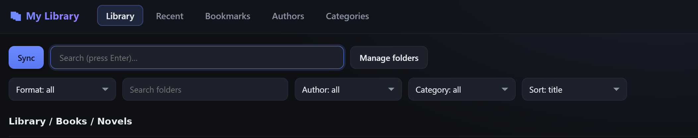
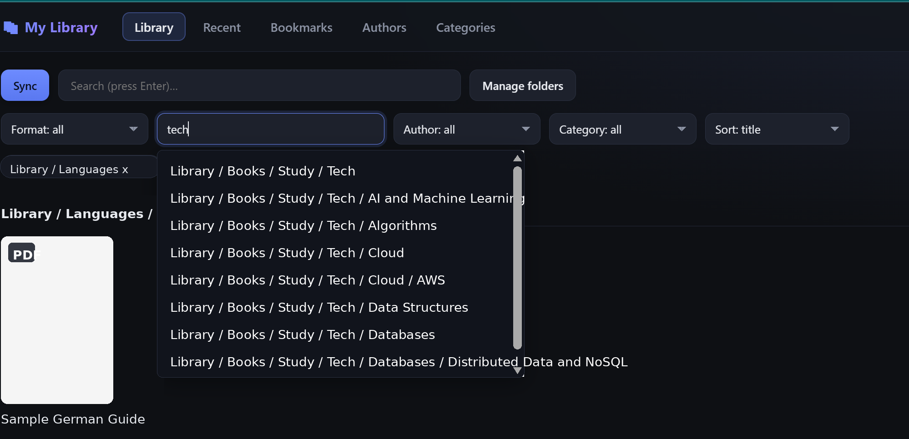

# My Library Reader

A local-first ebook **library and reader** that runs in your browser. Point it
at the folders where your books already live; it indexes them **in place**
(never copying, moving, or modifying the originals) and reads EPUB, PDF, TXT,
and HTML.

- 📚 Dense, folder-grouped library grid with extracted covers
- 🔎 Instant metadata search (FTS5) and Author / Category browsing
- 📖 PDF (scroll **or** paged) and EPUB readers with saved position, bookmarks,
  themes, and font/zoom controls
- 🔄 Background sync with live progress; detects new, changed, renamed, and
  deleted files
- ✏️ Editable metadata (title / authors / categories) + cover replace, stored
  in SQLite (your original files are never modified)
- 💾 Backup & restore of your metadata, bookmarks, and reading progress

> Runs entirely on your machine, bound to `localhost`. No account, no cloud.

## Screenshots





## Quick start

Requires **Python 3.10+** and **Node 18+**.

```bash
npm run setup     # installs backend (pip) + frontend (npm) deps — first time only
npm run dev       # starts BOTH servers
```

Then open **http://localhost:5173**.

No path is required to start — the library opens with a **"Welcome —
add a books folder"** prompt. Type the folder where your books live (on WSL a
Windows drive looks like `/mnt/d/Books`) and click **Sync Now**. You can
add multiple folders, with include/exclude rules.

> Want to skip the prompt? Set `LIBRARY_ROOT` in `backend/.env` (see
> `backend/.env.example`).

### One process, one port

```bash
npm start         # builds the frontend, then serves the whole app from :8011
```

Then open **http://localhost:8011**.

### Other commands

| Command | What it does |
|---------|--------------|
| `npm run dev`   | Backend + Vite with hot reload (two ports) |
| `npm start`     | Build + single-server mode on `:8011` |
| `npm run setup` | Install all dependencies |
| `npm test`      | Backend pytest + frontend Vitest |

## Documentation

- **[Architecture](docs/ARCHITECTURE.md)** — design, data model, sync, readers,
  security model
- **[Contributing](CONTRIBUTING.md)** — setup, tests, conventions

## Security and privacy

This is a local-only app with no authentication. It deliberately serves files
from folders you add, so keep it bound to `127.0.0.1` and do not expose the
backend port to a network or public tunnel.

Local runtime state is machine-specific and should stay out of public repos:
`backend/.env`, `backend/data/`, extracted covers, SQLite files, and local
notes.

## Not included (yet)

MOBI/AZW3, full-text search inside books, OCR, highlights/annotations,
file renaming, writing metadata back into the original files, audiobooks.

## License

[MIT](LICENSE)
